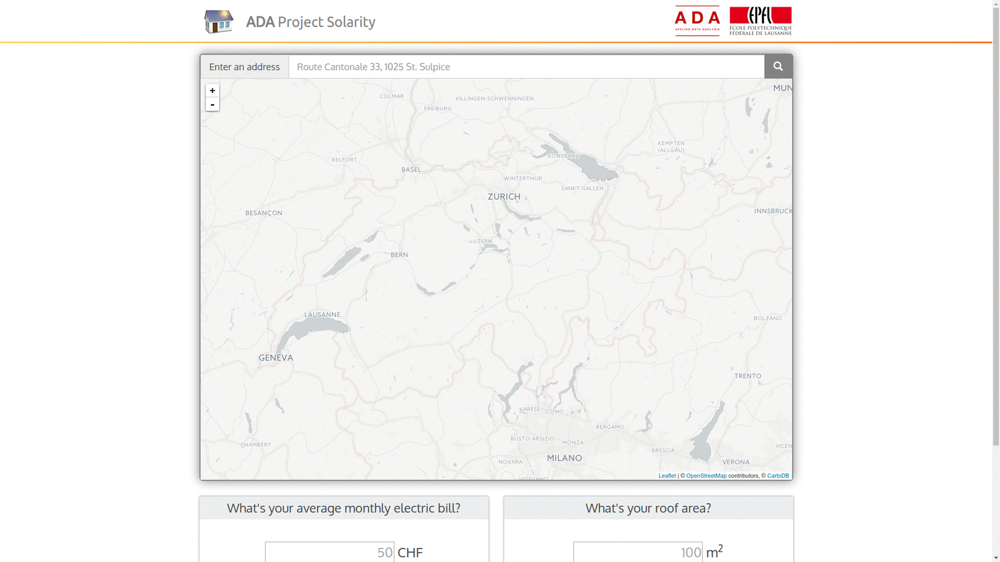

# Website

This module contains the website for the project.

It is a *responsive* website: the content automatically adapts to the screen size in order to ensure the best experience for all users on any device (desktops, tablets, and phones).

It uses Python in the backend, so it requires [Flask](http://flask.pocoo.org/).

## Installing Flask

To install Flask, run the following command on your terminal:
`sudo pip3 install flask`

## Running the website

Run the following command on your terminal: `python3 server.py`  
It will automatically open a new tab in your predefined browser at `localhost:5000/index`

## How it looks like

This is a preview of the website:   

## Description of the module

- `googleMaps.key`: file containing your key for the Google Maps Geocoding API.
- `server.py`: main Python script running the backend of the website. It relies on the [geocoding module](https://github.com/e-bug/solarity/tree/master/geocoding).
- `functions.py`: helper functions for `server.py` to compute the power potential for the entered address.
- `solarity_website.gif`: a GIF illustrating the website. Created at [gifmaker.me](http://gifmaker.me/).
- `stations_codename.p`: pickle file of a dictionary of stations codes and their names: {'code_station': 'name_station'}.
- `static/`: folder containing CSS, JS, fonts and images used in the website.
  - `css/`: contains the styles for the website.
    - based on the [Bootstrap](http://getbootstrap.com/) framework. 
    - `leaflet_awesome_markers.css` adds [awesome markers for Leaflet maps](https://github.com/lvoogdt/Leaflet.awesome-markers).
    - `ranger.css` contains custom style for sliders.
    - `style.css` contains all the custom styles applied in the website.
  - `fonts/`: contains *glyphicons* fonts.
  - `images/`: contains logos and markers used in the website.
  - `js/`: contains all the JS files, based on the Bootstrap framework. In particular,
    - `python-script.js`: executes functions by interacting with the Python backend.
    - `script.js`: contains functions which do not need the Python backend.
- `templates/`: contains the HTML files for the website (`index.html` here).
